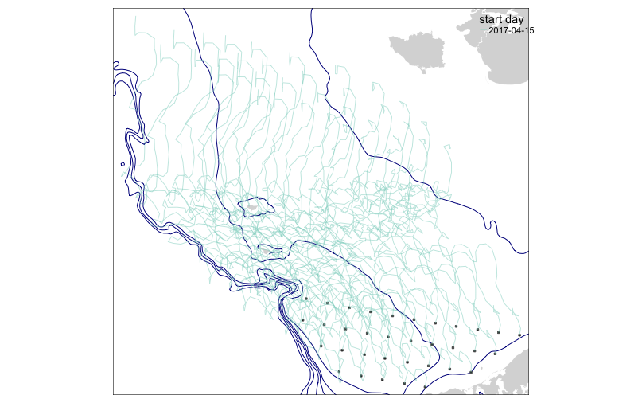

```{r, include = FALSE}
  knitr::opts_chunk$set(collapse = TRUE, comment = "##", eval=FALSE)
```
# rOSCURS
An R package to run OSCURS models and process the results.

## Installation requirements

The following packages are required to use rOSCURS:

  * dplyr (>= 0.8.0.1),
  * ggplot2 (>= 1.0.0),
  * magrittr (>= 1.5),
  * readr (>= 1.3.1),
  * reshape2 (>= 1.4.1),
  * sf (>= 0.7-3),
  * stringr (>= 1.4.0),
  * tibble (>= 2.0.1),
  * tmap (>= 2.2),
  * tmaptools (>= 2.0-1),
  * wtsGIS (>= 2019.02.07),
  * wtsUtilities (>= 2016.09.02)
  
The latter two packages are available on GitHub at https://github.com/wStockhausen/wtsGIS and https://github.com/wStockhausen/wtsUtilities. The remaining are avaialble from CRAN. Each of the above packages may have further dependencies not noted here.

## Runnning OSCURS

The following R script illustrates the basic usage of the functions in the package:

```{r}
library(rOSCURS);

#--read in a csv file with starting particle locations as a "tibble"
stLLs<-readr::read_csv(system.file("extdata","OSCURS_StartLocations.csv", package="rOSCURS"));
#--the file really only needs columns 
#----LATITUDE   - decimal degrees (-90:90)
#----LONGITUDE  - decimal degrees (-180:180)
#--but has some others including "STATION_ID", which is a unique identifier for each location

#--run the OSCURS model
#--the following runs the model for nDays per particle location for each year x month/day release
#--each run will create a file in the folder identified by the path parameter
#--[NOTE: try not to overwhelm the remote server with many tracks at once]
runOSCURS(fnBase="Test_",        #base file name for output tracks
          path="./test",         #path to output track files
          nDays=90,              #number of days to track
          stYrs=2017,            #years for releases
          stMDs=list(APR=15),    #months and days for releases
          stLLs=stLLs,           #the "tibble" with start locations
          link="https://oceanview.pfeg.noaa.gov/oscurs/runOscurs9.php?", #default link to use
          randNum=round(runif(1,1,100000)),                              #random number to add for server-side file names to ensure uniqueness
          test=FALSE,            #(don't) run the function without running OSCURS (to see server commands)
          verbose=TRUE);         #print diagnostic info

#--convert OSCURS output files to list with data.frame and sf tibble with a WGS84 lat/lon coordinate reference system.
#--[NOTE: stYrs and stMDs here might be different from above if you broke a large batch of
#--runs into several smaller batchs so as not to overwhelm the server.]
lst1<-convertOSCURStoTbl(fnBase="./test/Test_",                #base name here can include a path
                         stYrs=2017,                           #years for releases
                         stMDs=list(APR=15,MAY=c(1,15),JUN=1), #months and days for releases
                         stLLs=stLLs,                          #the "tibble" with start locations
                         verbose=FALSE);                       #(don't) print diagnostic info

#--plot map with tracks
lst2<-plotOSCURS(tracks=lst1$tracks,  #spatial "tibble" for tracks created by last function
                 stLLs=stLLs,        #dataframe with start locations
                 idCol="STATION_ID", #column name in stLLs with unique identifier (NULL if no such column)
                 alpha=0.5,          #using 50% transparency for track lines (better visiblity for many tracks if < 1)
                 showMap=FALSE);     #(don't) print the map immediately
print(lst2$map); #print the map 
```
The map resulting from making OSCURS runs for \code{stYrs=2017} and \code{stMDs=list(APR=15,MAY=c(1,15),JUN=1)} with
the start locations from the csv file above is:



Note that "stMDs=list(APR=15)" is used in the call to "runOSCURS" while "stMDs=list(APR=15,MAY=c(1,15),JUN=1)" is specified in the call to "convertOSCURStoTbl". In this example, only the April 15, 2017 tracks were created and written to the ./test folder. The call to "convertOSCURStoTbl" skips over the missing files, generating a message for each missing file but other wise not failing. However, if the "missing" files had been created by a previous call to "runOSCURS" (perhaps not to overload the server), they would have been plotted on the map as well.
